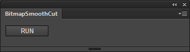

BitmapSmoothCut
=======

This is a jsfl file which sets image compression as PNG and turns off smoothing of BitmapItem.

Flash CC ライブラリ 選択したアイテム(or フォルダ)内の 各ビットマップデータに対し一括で、
画質を Lossless(PNG/GIF)化し スムージングを OFF にする JSFL です。

Flash CC にて psd から大量にデータを読み込む方向け。

---
## Download (Flash Pro CC 13.1 or later)

* [BitmapSmoothCut.zxp](https://raw.github.com/siratama/BitmapSmoothCut/master/download/BitmapSmoothCut.zxp)

This can be used by Flash CC 13.1 or later. In the case of Windows, it can save from a right-click. 
[Extension Manager Command Line tool(ExManCmd)](https://www.adobeexchange.com/resources/28) is required in order to install. 

Flash CC 13.1 以降のバージョンで利用可能です。Windows の場合、右クリックから「リンク先のコンテンツを保存」を選択で保存できます。インストールには別途 
インストールには別途 [Extension Manager Command Line tool(ExManCmd)](https://www.adobeexchange.com/resources/28)が必要です。
